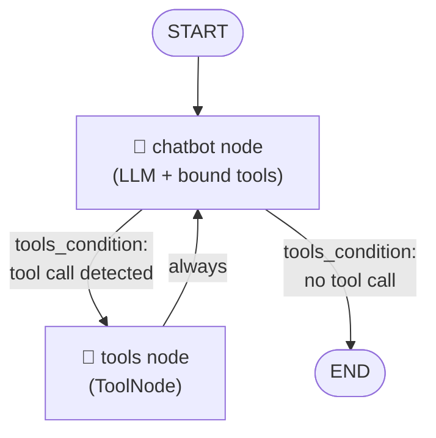
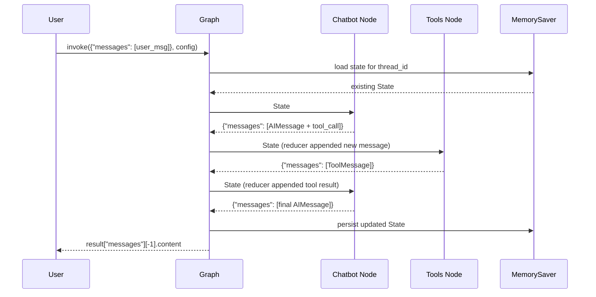

# LangGraph Chatbot with Search & Push Notifications

A conversational AI chatbot built with [LangGraph](https://github.com/langchain-ai/langgraph) and [Gradio](https://www.gradio.app/), powered by OpenAI's `gpt-4o-mini`. The agent can search the web in real-time and send push notifications to your phone via Pushover.

## Features

- **Web Search** — Uses Google Serper API to answer questions with up-to-date information
- **Push Notifications** — Sends notifications to your phone via the Pushover API
- **Conversational Memory** — Retains context across turns within a session using LangGraph's `MemorySaver`
- **Gradio UI** — Simple chat interface served locally in your browser

## Architecture

The agent is built as a LangGraph state graph:

```
START → chatbot ⇄ tools
```

- `chatbot` node: calls `gpt-4o-mini` with tools bound
- `tools` node: executes whichever tool the LLM selected (search or push)
- Conditional edges route between chatbot and tools automatically

## Prerequisites

- Python 3.14+
- [uv](https://github.com/astral-sh/uv) package manager

## Setup

1. **Clone the repo and install dependencies:**
   ```bash
   uv sync
   ```

2. **Create a `.env` file** with the following keys:
   ```env
   OPENAI_API_KEY=your_openai_api_key
   SERPER_API_KEY=your_serper_api_key
   PUSHOVER_TOKEN=your_pushover_app_token
   PUSHOVER_USER=your_pushover_user_key
   ```

3. **Run the app:**
   ```bash
   uv run main.py
   ```

   Then open the Gradio URL shown in the terminal (typically `http://127.0.0.1:7860`).

## Dependencies

| Package | Purpose |
|---|---|
| `langgraph` | Agent graph orchestration |
| `langchain-openai` | OpenAI LLM integration |
| `langchain-community` | Google Serper search utility |
| `langchain-core` | Tool definitions |
| `gradio` | Chat UI |
| `python-dotenv` | Environment variable loading |
| `requests` | Pushover HTTP calls |

---

## LangGraph Framework

LangGraph is a library from LangChain for building **stateful, multi-step AI agents** as directed graphs. Each node is a function; edges define the flow of control.

### Core Concepts

#### 1. State
The **State** is a shared data structure (TypedDict) passed between every node. Each node reads from it and returns updates to it.

```python
class State(TypedDict):
    messages: Annotated[list, add_messages]  # 'add_messages' is the reducer
```

#### 2. Nodes
A **node** is simply a Python function that receives the current `State` and returns a partial update.

```python
def chatbot(state: State):
    return {"messages": [llm.invoke(state["messages"])]}
```

#### 3. Edges

| Edge Type | Description |
|---|---|
| `add_edge(A, B)` | Always go from A → B |
| `add_conditional_edges(A, fn)` | Route based on output of `fn(state)` |
| `START` | Special entry point node |
| `END` | Special terminal node |

#### 4. Reducers
A **reducer** controls *how* new values are merged into existing state — instead of overwriting. `add_messages` appends new messages rather than replacing the list.

```python
messages: Annotated[list, add_messages]
#                         ^^^^^^^^^^^
#                         reducer function
```

Without a reducer, each node update would overwrite the field entirely.

#### 5. ToolNode & tools_condition
- **`ToolNode`** — a built-in node that automatically executes whichever tool the LLM called
- **`tools_condition`** — a built-in conditional function that routes to `tools` if the LLM produced a tool call, otherwise routes to `END`

#### 6. Checkpointer / Memory
A **checkpointer** (e.g. `MemorySaver`) persists state between invocations, enabling multi-turn memory keyed by `thread_id`.

---

### Graph Architecture



---

### State Flow Diagram



---

### How This Project Maps to These Concepts

| Concept | This Project |
|---|---|
| State | `messages` list with `add_messages` reducer |
| Chatbot node | `gpt-4o-mini` with search + push tools bound |
| Tools node | `ToolNode([tool_search, tool_push])` |
| Conditional edge | `tools_condition` routes LLM → tools or END |
| Checkpointer | `MemorySaver` keyed by `thread_id = "1"` |
| Entry point | `add_edge(START, "chatbot")` |
